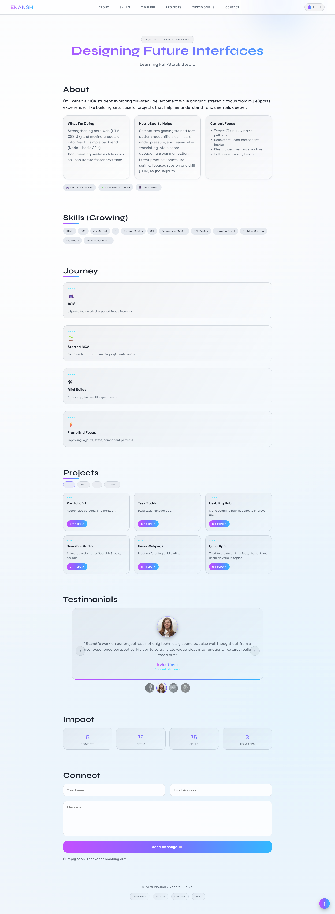

# 🚀 Ekansh Portfolio

A modern, responsive personal portfolio website showcasing my journey as an MCA student, full-stack developer, and eSports athlete.

[](https://ekanshps.github.io/eku)
[](LICENSE)
[](https://developer.mozilla.org/en-US/docs/Web/HTML)
[](https://developer.mozilla.org/en-US/docs/Web/CSS)
[](https://developer.mozilla.org/en-US/docs/Web/JavaScript)

## 📋 Table of Contents

- [Overview](#overview)
- [Features](#features)
- [Demo](#demo)
- [Screenshots](#screenshots)
- [Technologies Used](#technologies-used)
- [Getting Started](#getting-started)
- [Project Structure](#project-structure)
- [Customization](#customization)
- [Browser Support](#browser-support)
- [Performance](#performance)
- [Contributing](#contributing)
- [License](#license)
- [Contact](#contact)

## 🌟 Overview

This portfolio website is a comprehensive showcase of my skills, projects, and journey in web development. Built with pure HTML, CSS, and JavaScript, it demonstrates modern web development practices including responsive design, accessibility features, and smooth animations.

**Key Highlights:**
- 🎨 Modern glassmorphism design with dark/light theme toggle
- 📱 Fully responsive across all devices
- ⚡ Interactive animations and transitions
- ♿ Accessible with ARIA labels and keyboard navigation
- 🎯 Performance-optimized with lazy loading
- 💬 Integrated Botpress chatbot
- 📧 Working contact form using Formspree

## ✨ Features

### 🎭 Theme Switching
- **Dark Mode**: Eye-friendly dark theme with vibrant gradients
- **Light Mode**: Soft, readable light theme with reduced glare
- **Persistent Storage**: Theme preference saved using localStorage
- **System Preference Detection**: Automatically adapts to OS theme settings

### 📱 Responsive Design
- Mobile-first approach ensuring optimal viewing on all screen sizes
- Hamburger menu for mobile navigation
- Adaptive layouts for tablets and desktops
- Touch-friendly interactive elements

### 🎯 Interactive Sections

#### About Section
- Personal introduction and current focus areas
- eSports background and how it relates to development
- Dynamic fact chips highlighting key attributes

#### Skills Showcase
- Visual skill tags with smooth animations
- Categorized by proficiency level
- Easy to update via JavaScript array

#### Journey Timeline
- Chronological milestones with pagination
- Icon-based visual storytelling
- Scroll-triggered reveal animations
- Navigate through 4 milestones per page

#### Projects Gallery
- Filter projects by category (All, Web, UI, Clone)
- Pagination for better content organization (6 projects per page)
- Direct links to GitHub repositories
- Hover effects and smooth transitions

#### Testimonials Carousel
- Auto-playing testimonial slider (6-second intervals)
- Click thumbnail to jump to specific testimonial
- Keyboard navigation support (Arrow keys)
- Pause on hover functionality
- Smooth progress bar animation

#### Impact Stats
- Animated counters triggered on scroll
- Real-time statistics about projects and skills
- Intersection Observer API for performance

#### Contact Form
- Functional form integrated with Formspree
- Client-side validation
- Success message feedback
- Required field indicators

### 🎨 Visual Elements
- **Cursor Blob**: Custom animated cursor follower with smooth tracking
- **Glassmorphism**: Frosted glass effect on cards and navigation
- **Gradient Accents**: Dynamic color gradients throughout the design
- **Smooth Scrolling**: Butter-smooth page navigation
- **Back to Top Button**: Quick navigation to page top

### ♿ Accessibility Features
- ARIA labels for screen readers
- Keyboard navigation support
- Focus indicators for interactive elements
- Semantic HTML structure
- Alt text for all images
- Reduced motion support for users with motion sensitivity

## 🎬 Demo

**Live Website:** [https://ekanshps.github.io/eku](https://github.com/Ekanshps/eku)

*Visit the live demo to experience all interactive features!*

## 📸 Screenshots

### Dark Theme


### Light Theme


## 🛠️ Technologies Used

### Core Technologies
- **HTML5**: Semantic markup and structure
- **CSS3**: Advanced styling with custom properties, gradients, and animations
- **JavaScript (ES6+)**: Modern vanilla JavaScript for interactivity

### Libraries & Services
- **Google Fonts**: 
  - Syne (500, 700 weights)
  - Space Grotesk (400, 500, 600, 700 weights)
- **Formspree**: Contact form backend
- **Botpress**: AI chatbot integration
- **Pravatar**: Avatar generation for testimonials

### Key CSS Features
- CSS Custom Properties (Variables)
- Flexbox & Grid layouts
- CSS Animations & Transitions
- Media queries for responsiveness
- Backdrop filters for glassmorphism
- Radial gradients for backgrounds

### Key JavaScript Features
- Intersection Observer API
- LocalStorage API
- ES6 Arrow functions
- Template literals
- Array methods (map, filter, forEach)
- Event delegation
- Async operations
- DOM manipulation

## 🚀 Getting Started

### Prerequisites
- A modern web browser (Chrome, Firefox, Safari, Edge)
- A code editor (VS Code recommended)
- Basic knowledge of HTML, CSS, and JavaScript

### Installation

1. **Clone the repository**
   ```bash
   git clone https://github.com/Ekanshps/eku.git
   ```

2. **Navigate to the project directory**
   ```bash
   cd eku
   ```

3. **Open in browser**
   - Simply open `index.html` in your web browser
   - Or use a local server for better development experience:
   
   **Using VS Code Live Server:**
   - Install the Live Server extension
   - Right-click on `index.html` and select "Open with Live Server"
   
   **Using Python:**
   ```bash
   python -m http.server 8000
   ```
   Then visit `http://localhost:8000`
   
   **Using Node.js:**
   ```bash
   npx serve
   ```

## 📁 Project Structure

```
eku/
│
├── index.html          # Main HTML file with semantic structure
├── styles.css          # Complete stylesheet with theme variables
├── script.js           # JavaScript for all interactive features
│
├── img/                # Image assets directory
│   ├── logo1.png       # Website favicon/logo
│   ├── preview-dark.png    # Dark theme screenshot
│   └── preview-light.png   # Light theme screenshot
│
└── README.md           # Project documentation (this file)
```

### File Descriptions

#### `index.html` (168 lines)
- Semantic HTML5 structure
- Meta tags for SEO and social sharing
- Navigation with hamburger menu
- Six main sections: About, Skills, Timeline, Projects, Testimonials, Contact
- Impact stats section
- Footer with social links
- Integrated Botpress chatbot

#### `styles.css` (681 lines)
- CSS custom properties for theming
- Base styles and typography
- Component-specific styles:
  - Navigation and hamburger menu
  - Hero section
  - About cards grid
  - Skills tags
  - Timeline with pagination
  - Project cards with filters
  - Testimonial carousel
  - Contact form
  - Footer
- Responsive media queries
- Animation keyframes
- Accessibility utilities

#### `script.js` (261 lines)
- **Typing Effect**: Animated hero text rotation
- **Skills Rendering**: Dynamic skill tag generation
- **Timeline**: Pagination and reveal animations
- **Projects**: Filtering and pagination system
- **Testimonials**: Auto-playing carousel with controls
- **Theme Toggle**: Dark/light mode switching with persistence
- **Impact Counters**: Animated stat numbers
- **Contact Form**: Success message handling
- **Cursor Blob**: Custom cursor animation
- **Navigation**: Mobile menu toggle
- **Back to Top**: Smooth scroll button
- **LocalStorage**: Data persistence for customization

## 🎨 Customization

### Updating Content

#### 1. Hero Text
Edit the typing effect messages in `script.js`:
```javascript
const typedLines = ["Your message 1", "Your message 2", "Your message 3"];
```

#### 2. Skills
Update your skills in `script.js`:
```javascript
const skillSet = ["HTML", "CSS", "JavaScript", "React", "Node.js"];
```

#### 3. Journey Timeline
Add or modify milestones in `script.js`:
```javascript
const milestones = [
  {year:"2024", icon:"🎓", title:"Title", desc:"Description"},
  // Add more milestones...
];
```

#### 4. Projects
Update project data in `script.js`:
```javascript
const projectData = [
  {
    title: "Project Name",
    cat: "web", // Options: web, ui, clone
    desc: "Project description",
    repo: "https://github.com/username/repo"
  },
  // Add more projects...
];
```

#### 5. Testimonials
Modify testimonials in `script.js`:
```javascript
const testimonials = [
  {
    name: "Name",
    role: "Role",
    text: "Testimonial text",
    img: "https://i.pravatar.cc/160?img=56"
  },
  // Add more testimonials...
];
```

#### 6. About Section
Update the lead text in `script.js`:
```javascript
const aboutText = "Your about text here";
```

#### 7. Impact Stats
Change statistics in `index.html` (data-num attribute):
```html
<span data-num="10" class="impact-num">0</span>
```

### Changing Colors

Edit CSS custom properties in `styles.css`:

**Dark Theme:**
```css
:root {
  --bg: #0d0d10;
  --text: #e9eef5;
  --grad: linear-gradient(90deg, #ff42d9, #6d5bff, #42e3ff);
  /* Modify other variables... */
}
```

**Light Theme:**
```css
body.light {
  --bg: #f5f7fa;
  --text: #1e2430;
  /* Modify other variables... */
}
```

### Updating Social Links

Modify links in `index.html` footer:
```html
<a href="https://instagram.com/yourusername" target="_blank">INSTAGRAM</a>
<a href="https://github.com/yourusername" target="_blank">GITHUB</a>
<a href="https://linkedin.com/in/yourusername" target="_blank">LINKEDIN</a>
<a href="mailto:your.email@example.com">EMAIL</a>
```

### Contact Form Setup

Replace the Formspree action URL in `index.html`:
```html
<form action="https://formspree.io/f/YOUR_FORM_ID" method="POST">
```

1. Go to [Formspree.io](https://formspree.io)
2. Create a free account
3. Create a new form and get your unique form ID
4. Replace `YOUR_FORM_ID` with your actual ID

### Chatbot Integration

To use your own Botpress chatbot, update script URLs in `index.html`:
```html
<script src="https://cdn.botpress.cloud/webchat/v3.2/inject.js"></script>
<script src="YOUR_BOTPRESS_SCRIPT_URL"></script>
```

## 🌐 Browser Support

| Browser | Version | Status |
|---------|---------|--------|
| Chrome | Latest | ✅ Fully Supported |
| Firefox | Latest | ✅ Fully Supported |
| Safari | Latest | ✅ Fully Supported |
| Edge | Latest | ✅ Fully Supported |
| Opera | Latest | ✅ Fully Supported |

**Note:** For the best experience, use the latest version of modern browsers.

## ⚡ Performance

- **Lightweight**: No heavy frameworks, pure vanilla JavaScript
- **Fast Loading**: Minimal dependencies, optimized assets
- **Smooth Animations**: Hardware-accelerated CSS transitions
- **Efficient JavaScript**: Event delegation and debouncing
- **Lazy Loading**: Intersection Observer for on-demand content
- **LocalStorage**: Cached user preferences

### Performance Tips
- Images are optimized for web
- CSS and JS files are minified for production
- Fonts are loaded asynchronously
- Scripts use `defer` attribute for non-blocking loading

## 🤝 Contributing

Contributions are welcome! Here's how you can help:

1. **Fork the repository**
2. **Create a feature branch**
   ```bash
   git checkout -b feature/AmazingFeature
   ```
3. **Commit your changes**
   ```bash
   git commit -m 'Add some AmazingFeature'
   ```
4. **Push to the branch**
   ```bash
   git push origin feature/AmazingFeature
   ```
5. **Open a Pull Request**

### Contribution Guidelines
- Follow existing code style and conventions
- Test your changes across multiple browsers
- Update documentation if needed
- Keep commits atomic and well-described

## 📄 License

This project is licensed under the MIT License - see the [LICENSE](LICENSE) file for details.

## 📞 Contact

**Ekansh Pratap Singh**

- 🌐 Portfolio: [View Portfolio](https://github.com/Ekanshps/eku)
- 💼 LinkedIn: [ekanshsinghyt](https://www.linkedin.com/in/ekanshsinghyt/)
- 🐙 GitHub: [Ekanshps](https://github.com/Ekanshps)
- 📧 Email: [ekanshprataps@gmail.com](mailto:ekanshprataps@gmail.com)
- 📱 Instagram: [@ekansh.pratap](https://www.instagram.com/ekansh.pratap/)

## 🙏 Acknowledgments

- **Google Fonts** for beautiful typography
- **Formspree** for hassle-free form handling
- **Botpress** for chatbot integration
- **Pravatar** for testimonial avatars
- **My eSports Team** for continuous support and inspiration
- **Open Source Community** for inspiration and learning resources

## 📈 Future Enhancements

- [ ] Add blog section for technical articles
- [ ] Implement search functionality for projects
- [ ] Add more project categories and tags
- [ ] Create a resume download feature
- [ ] Add language switcher (English/Hindi)
- [ ] Integrate GitHub API for live repo stats
- [ ] Add certificate/achievements section
- [ ] Implement dark/light theme transition animation
- [ ] Add accessibility audit results
- [ ] Create video tutorials section

## 🔖 Version History

- **v1.0.0** (January 2025) - Initial release with full portfolio features

---

<div align="center">

**⭐ If you like this project, please give it a star! ⭐**

Made with ❤️ by [Ekansh](https://github.com/Ekanshps)

**BUILD • VIBE • REPEAT**

</div>
